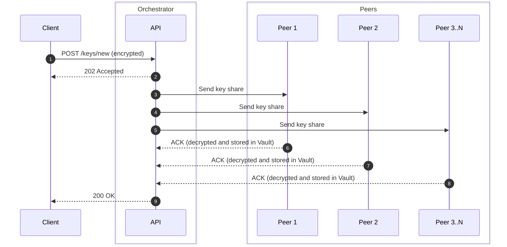
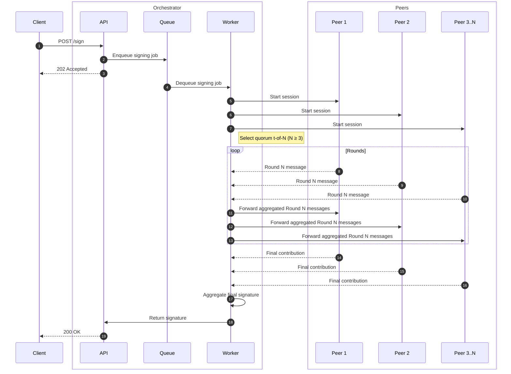

# Multi-Party Computation Signer API

This document describes the sequence diagrams for the key shares management and signing process in a Multi-Party Computation (MPC) Signer API system.

## Compatibility

| OS                 | Status |
| ------------------ | ------ |
| macOS              | ✅     |
| Linux              | ✅     |
| Windows (via WSL2) | ✅     |
| Native Windows     | ✅     |

## Prerequisites

- [Docker](https://www.docker.com) and Docker Compose
- [Node.js](https://nodejs.org)
- [Bun](https://bun.sh)
- [Act](https://github.com/nektos/act) for local GitHub Actions testing

### Shares management

The shares management process involves distributing encrypted key shares to multiple peers for secure storage. Each peer is responsible for decrypting and storing its share in a secure vault.

### Signing process

The signing process involves coordinating multiple peers to collaboratively generate a digital signature without exposing the private key. The orchestrator API receives signing requests, enqueues them for processing, and the worker interacts with the peers to perform the signing operation.

