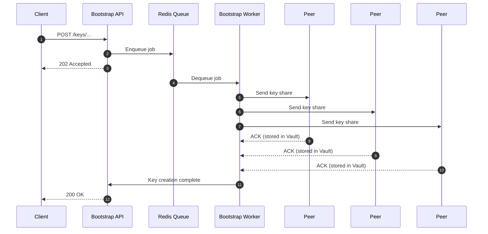
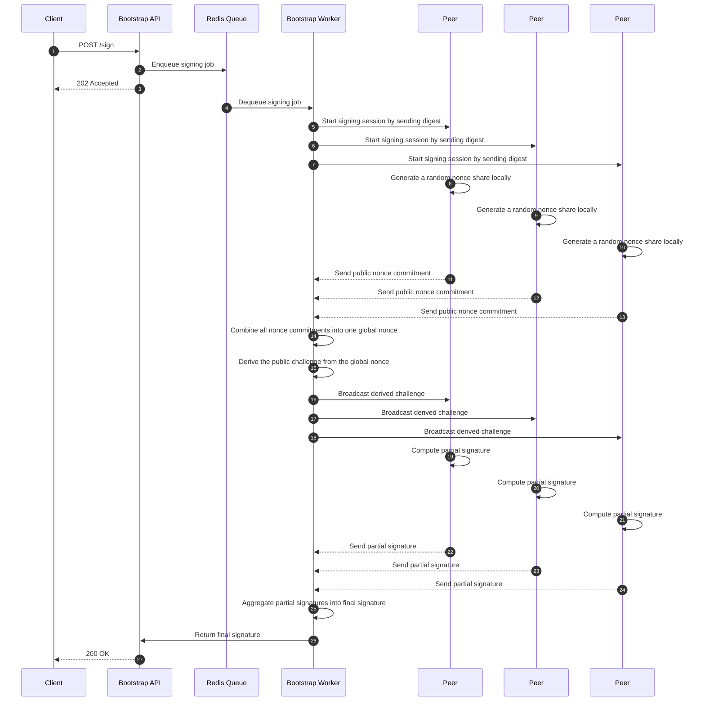

# Multi-Party Computation Signer API

This document describes the architecture and workflow of a Multi-Party Computation (MPC) Signer API that enables secure key management and signing operations using distributed peers. The system leverages a bootstrap API, a worker process, and multiple peers that hold shares of cryptographic keys.

## Shares management

Each peer in the mesh holds a unique share of the cryptographic key, managed securely within its own Vault instance. The bootstrap worker coordinates signing requests by communicating with the peers to obtain partial signatures.

## Signing process

The signing process involves coordinating multiple peers to generate a valid signature without any single peer having access to the complete private key.

