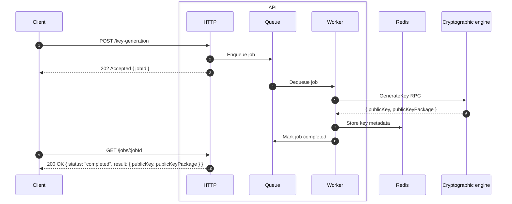
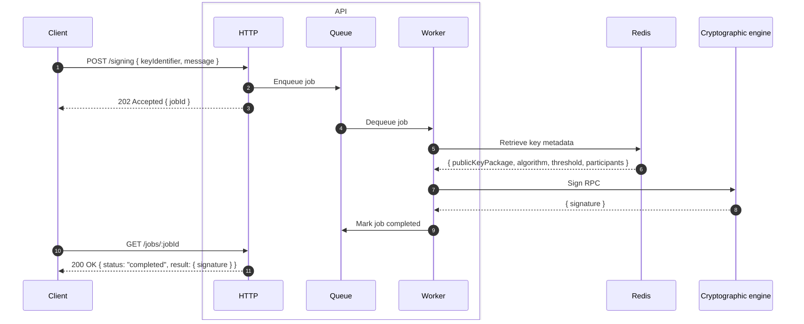

# Multi-Party Computation Controller API

NestJS HTTP API for the multi-party computation controller. Exposes key generation and threshold signing endpoints, enqueues jobs via BullMQ, and dispatches them to the cryptographic engine over gRPC. Clients poll for job completion.

## Compatibility

| OS                 | Status |
| ------------------ | ------ |
| macOS              | ✅      |
| Linux              | ✅      |
| Windows (via WSL2) | ✅      |
| Native Windows     | ✅      |

## Prerequisites

- [Docker](https://www.docker.com) and Docker Compose
- [Node.js](https://nodejs.org)
- [Bun](https://bun.sh)
- [Act](https://github.com/nektos/act) for local GitHub Actions testing

### Key generation

The client submits a key generation request. The API enqueues the job and returns a job ID immediately. The worker calls the Rust engine via gRPC, which coordinates the multi-party computation protocol across nodes. On completion the public key and key package are stored in Redis and exposed through the polling endpoint.

### Signing

The client submits a signing request referencing a previously generated key. The worker retrieves the key metadata from Redis, then calls the Rust engine to produce a threshold signature. The client polls until the job completes.

