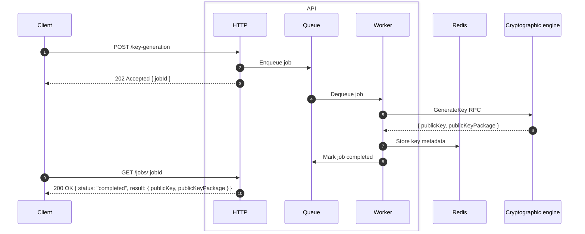
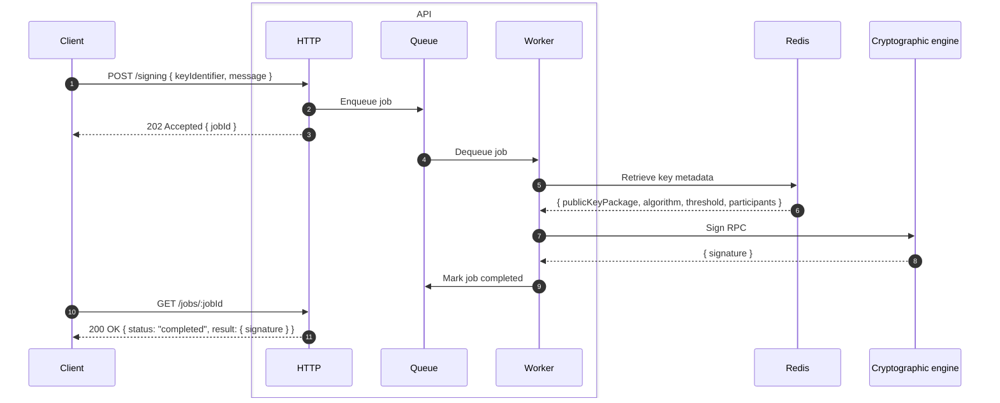

# Multi-Party Computation Controller API

NestJS HTTP API for the multi-party computation controller. Exposes key generation and threshold signing endpoints, enqueues jobs via BullMQ, and dispatches them to the cryptographic engine over gRPC. Clients poll for job completion.

## Compatibility

| OS                 | Status |
| ------------------ | ------ |
| macOS              | ✅      |
| Linux              | ✅      |
| Windows (via WSL2) | ✅      |
| Native Windows     | ✅      |

## Prerequisites

- [Docker](https://www.docker.com) and Docker Compose
- [Node.js](https://nodejs.org)
- [Bun](https://bun.sh)
- [Act](https://github.com/nektos/act) for local GitHub Actions testing

### Key generation

The client submits a key generation request. The API enqueues the job and returns a job ID immediately. The worker calls the Rust engine via gRPC, which coordinates the multi-party computation protocol across nodes. On completion the public key and key package are stored in Redis and exposed through the polling endpoint.



### Signing

The client submits a signing request referencing a previously generated key. The worker retrieves the key metadata from Redis, then calls the Rust engine to produce a threshold signature. The client polls until the job completes.



## API Reference

### `POST /key-generation`

Enqueues a distributed key-generation job.

**Request:**

```http
POST /key-generation
Authorization: Bearer <token>
Content-Type: application/json
```

```json
{
  "keyIdentifier": "<key_identifier: string>",
  "algorithm": "<algorithm: Algorithm>",
  "threshold": "<threshold: number>",
  "participants": "<participants: number>"
}
```

**Response:** `202 Accepted`

```json
{
  "jobId": "<job_id: string[UUIDv4]>"
}
```

---

### `POST /signing`

Enqueues a threshold-signature job. Requires a previously completed key-generation for the given `keyIdentifier`.

**Request:**

```http
POST /signing
Authorization: Bearer <token>
Content-Type: application/json
```

```json
{
  "keyIdentifier": "<key_identifier: string>",
  "message": "<message: string>"
}
```

**Response:** `202 Accepted`

```json
{
  "jobId": "<job_id: string[UUIDv4]>"
}
```

---

### `GET /jobs/:jobId`

Returns the current status of a job. The `:jobId` must be a valid UUID.

**Request:**

```http
GET /jobs/<job_id>
Authorization: Bearer <token>
```

**Response:** `200 OK`

```json
{
  "jobId": "<job_id: string[UUIDv4]>",
  "type": "<job_type: JobType>",
  "status": "<job_status: JobStatus>",
  "result": "<result: JobResult | null>",
  "error": "<error: string | null>",
  "createdAt": "<created_at: string[ISO8601]>",
  "updatedAt": "<updated_at: string[ISO8601]>"
}
```

* `JobType`: see [documentation](https://shreeed-app.github.io/multi-party-computation-controller-api/enums/jobs_jobs.types.JobType.html) for possible enum values.
* `JobStatus`: see [documentation](https://shreeed-app.github.io/multi-party-computation-controller-api/enums/jobs_jobs.types.JobStatus.html) for possible enum values.
* `JobResult`: see [documentation](https://shreeed-app.github.io/multi-party-computation-controller-api/types/jobs_jobs.types.JobResult.html) for possible result structures.

**Error response:** `404 Not Found` - job does not exist.

```json
{
  "message": "<error_message: string>"
}
```
